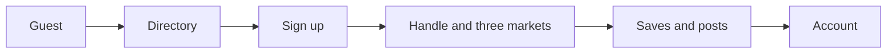
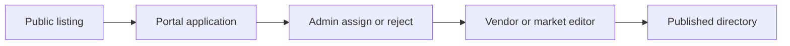
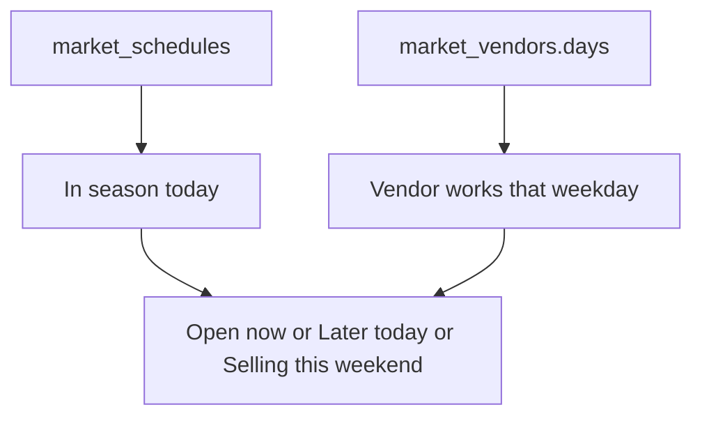
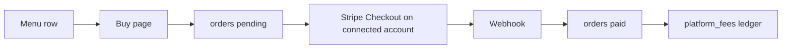

# MarketRegular site structure

Snapshot date: 7 October 2026. This file is a map for other models. When it disagrees with the code, the code wins. It describes the product as built. It is not a redesign brief.

Brand string is `SITE_NAME` in `src/lib/constants.ts`: **MarketRegular** (one word). Operator is LocalGovy Inc., Ontario. Public site is `https://www.marketregular.com`. Inbox for account requests is `CLAIM_INBOX` (`noah@localgovy.com`).

Launch copy uses Toronto / GTA and timezone `America/Toronto` (`src/lib/launch.ts`). The live directory is every `published` listing, not a city allowlist. The homepage census counts published markets, vendors, and menu rows. The bundled seed in `src/data/directory.ts` is only the fallback when Supabase is unset.

## Facts models usually get wrong

- Sales are off. `VENDOR_SALES_OPEN` is `false` in `src/lib/selling.ts`. The view `published_menus.can_buy` is hardcoded `false` (`supabase/migrations/20261003161240_pause_vendor_item_sales.sql`). Checkout, Stripe Connect, orders, and the platform-fee ledger exist and are closed.
- There is no day planner and no live “selling now” toggle. Open state is computed from `market_schedules` plus roster days. Save is the only keep action.
- There is no `market` role. A market operator is `markets.claimed_by`. Assigning a stall sets `profiles.role` to `vendor` unless the person is already `admin`.
- One owner per listing (`claimed_by`). No staff table, no invites.
- `/contact` permanently redirects to `/`. `/vendors`, `/search`, and `/kept` only redirect. `/admin/claims` redirects to `/admin/applications`.
- New shopper notes are `posts`. The `reviews` table is older rows, still shown, not written by the shopper composer.
- `claim_requests` is the older claim path. The live request is `portal_applications`. Pending rows of either kind still skip shopper onboarding.
- The “Verified” mark is a hardcoded stamp on `the-leslieville-farmers-market` (`src/components/verified-stamp.tsx`). It is not `posts.verified_on_site`. That column is always inserted `false` and the app never reads it.
- `geofence_radius_m` (default 250) only suggests the nearest hall in the review composer when the browser is inside that radius. It does not prove a visit, and it does not gate posting.
- Directory “score” is the external `rating_avg` / `review_count` stored on the listing. It is not computed from on-site posts.
- `posts` is on the `supabase_realtime` publication. The app does not subscribe. The tape refreshes on the 120s directory cache and on `revalidatePublishedDirectory`.
- Product search is food categories only. Crafts, jewelry, and plants can be listing tags and still be absent from `/products`.
- A season alias is a second database row that 308s onto a host. A sibling is a separate page with a cross-link. Only Leslieville’s indoor hall is an alias. The other pairs stay as two URLs.

## Actors

| Actor | How the system knows them | Surface |
| --- | --- | --- |
| Guest | No session | Public read of directory, products, events, feed, blog, find pages |
| Consumer | `profiles.role = user`, and `onboarded_at` set | Same reads, plus saves, posts, account, week email |
| Vendor | `vendors.claimed_by` is their profile. Role becomes `vendor` unless they are `admin` | `/vendor`, `/vendor/[id]` |
| Market operator | `markets.claimed_by` only. Role stays `user` unless they are also a vendor or admin | `/market`, `/market/[id]` |
| Admin | `profiles.role = admin`, set in SQL. Not an env flag | `/admin/*` |

The same account can own stalls and markets at once. `/account` lists both.

A stall a market creates has `vendors.created_by_market_id` set, `claimed_by` null, `selling_approved` false, status `published`. That market can edit the stall profile only while it created the row and nobody has claimed it and no portal request is pending. A later vendor claim removes that edit right.

### Identity gates

Shopper onboarding (`src/lib/onboarding.ts`, enforced in `src/lib/supabase/middleware.ts` on GET/HEAD): a signed-in person with no `onboarded_at` is sent to `/onboarding` until they save a handle and three markets. Skipped when `role = vendor`, or when `awaiting_vendor_portal()` / `awaiting_market_portal()` is true (owns a listing, or has a pending `portal_applications` or `claim_requests` row of that kind).

Paths exempt from that redirect: `/onboarding`, `/auth/*`, `/login`, `/signup`, `/account/password`, `/privacy`, `/terms`, `/vendor` and `/vendor/*`, `/market` and `/market/*`, and `/vendors/:slug/buy|orders/…`.

Forced password: `app_metadata.must_set_password = true` (issued one-time password) redirects every page except `/account/password` and `/auth/*` to `/account/password`. While that flag is set, `password_change_pending()` blocks `owns_vendor`, `owns_market`, and the portal RPCs.

`/account` requires a session. Unsigned `/onboarding` goes to login.

## Request path

Entry is `proxy` in `src/proxy.ts` (Next.js middleware matcher, skipping static assets).

1. GET/HEAD with `{` or `}` in a query value drops those params with a 308. Search engines fetch the sitelinks template literally. Real searches such as `/markets?q=bread` stay.
2. Renamed market and vendor slugs 308 to the current path. Sources are `src/data/listing-redirects.ts` plus `listing_slug_aliases` merged at build time. Season aliases and retired slugs also 308.
3. `/auth/callback?token_hash=…` rewrites to `/auth/confirm`. `/auth/callback` with `code` or an OAuth error rewrites to `/auth/pkce`.
4. `updateSession` refreshes the Supabase cookie, then applies the password gate and the onboarding gate.

`next.config.ts` also 308s `/contact` → `/`, `/search` → `/products`, `/vendors` → `/markets`, a set of folded `/find/…` slugs, and listing slug aliases. `/kept` redirects in the page to `/saved`. `/admin/claims` redirects (not permanent) to `/admin/applications`.

## Route catalog

Shared chrome is `src/app/layout.tsx`: header, footer, guest sign-in slip, nav history, JSON-LD, Google Analytics `G-M2JJ68QT2H`, Vercel Analytics. Header nav (`src/lib/nav.ts`): Home, Events, Markets, Products, Blog, Saved. Footer adds Feed, About, Vendor sign in, Market sign in, Privacy, Terms. Header search posts to `/markets?q=`.

Status words used below: **live**, **paused** (built, switched off), **redirect**, **legacy**.

### Public read

| Path | Status | Who | What | Data |
| --- | --- | --- | --- | --- |
| `/` | live | Everyone | Home: census, week, map, vendors today and this week, review tape, featured blog, saved rail | Published directory. Revalidate 120s |
| `/markets` | live | Everyone | Directory. Query `q`, `weekday`, `tag`, `area`, `setup`, `openNow`, `lat`, `lng`, `sort`, plus `province` / `city`. Canonical is always `/markets` | Bare visit: `getBareMarketsDirectory`. Any filter: `searchDirectory` |
| `/markets/[slug]` | live | Everyone | Hours, map, vendors, tags, contact, reviews, save, claim CTA. Static params, revalidate 1h | `getMarketBySlug`, `getListingContact` |
| `/markets/day` | live | Everyone | Seven weekday cards | Schedules |
| `/markets/day/[day]` | live | Everyone | One weekday. Slugs `sunday`…`saturday` | `marketsOnWeekday` |
| `/markets/open-today` | live | Everyone | Open now, later today, already closed, tomorrow | Toronto clock |
| `/markets/tag/[tag]` | live | Everyone | Category page. Vendor list capped at 48 when scope is both | `CATEGORIES` in `src/lib/landing.ts` |
| `/products` | live | Everyone | Product search. Query `q`, `open=1`, `market`, `day`. Filtered URLs are noindex. Bare `/products` is indexable | `searchProducts`, `searchVendorsByName` |
| `/find/[slug]` | live | Everyone | Fixed product page. `dynamicParams = false`. Index only if at least 5 vendors | `FIND_PAGES` in `src/data/find-pages.ts` (100 pages) |
| `/vendors/[slug]` | live | Everyone | Stall: markets, menu, reviews, save, claim CTA. Thin pages (name and halls only) are noindex, follow | `getVendorBySlug` |
| `/events` | live | Everyone | Month grid and this week. Query `m=YYYY-MM`, `d` | Markets and schedules |
| `/feed` | live | Read: everyone. Write: signed-in | Posts and older reviews. Query `q`, `market`, `vendor`, `tag`, `sort`. Footer only, not header | `getFloorTape` |
| `/blog`, `/blog/[slug]` | live | Everyone | Nine markdown files in `content/blog/`. Stale weekend guides stay generated and are noindex | `src/lib/blog.ts` |
| `/about` | live | Everyone | Static | Constants |
| `/privacy`, `/terms` | live | Everyone | Legal. Effective 2 October 2026 | Constants |
| `/saved` | live | Guests see a sign-in prompt. Signed-in see their list | noindex, robots-disallowed | `readMySaves` |

### Auth and account

| Path | Status | Who | What |
| --- | --- | --- | --- |
| `/signup`, `/login` | live | Guests. Signed-in people are redirected | Password and Google. Crawlable, noindex |
| `/onboarding` | live | New shoppers | Handle plus three published markets |
| `/account` | live | Signed-in, onboarded (or a portal skip) | Profile, saves, week, orders, posts, portal links, delete account |
| `/account/password` | live | Signed-in | Set or change password. Forced when `must_set_password` |
| `/auth/confirm` | live | Auth | Email OTP form so mail scanners do not consume the link. `verifyEmailOtp` |
| `/auth/pkce` | live | Auth | GET code exchange |
| `/auth/callback` | live | Auth | Client leftover for the hash / implicit flow. Middleware rewrites token and code onto the two routes above |

### Portals, buy, admin, API

| Path | Status | Who | What |
| --- | --- | --- | --- |
| `/vendor`, `/vendor/[id]` | live | Stall owner or applicant. `force-dynamic`, noindex | Portal home and editor. Unsigned editor redirects to login |
| `/market`, `/market/[id]` | live | Market owner or applicant. `force-dynamic`, noindex | Portal home and editor |
| `/vendors/[slug]/buy/[itemId]` | paused | Would be signed-in | 404 while sales are closed |
| `/vendors/[slug]/orders/[orderId]` | paused | Buyer | Receipt. Confirm path exists. Buy page does not |
| `/admin` | live | `is_admin()` | Counts |
| `/admin/markets`, `/admin/markets/new`, `/admin/markets/[id]` | live | Admin | List, create, edit, hours, roster, owner, delete |
| `/admin/vendors`, `/admin/vendors/new`, `/admin/vendors/[id]` | live | Admin | List, create, edit, menu, selling switch, owner, delete |
| `/admin/updates` | live | Admin | Listings grouped by maintenance opt-out |
| `/admin/moderation` | live | Admin | Flag and restore posts and reviews |
| `/admin/applications` | live | Admin | Assign or reject portal applications and legacy claims |
| `/admin/saves` | live | Admin | Read-only saves by person |
| `GET /api/search` | live | Public | `?q=` returns up to 8 products and 8 vendors. 429 when the catalog slot is spent |
| `POST /api/stripe/account-session` | paused | Stall owner | 403 while sales are closed |
| `POST /api/stripe/webhook` | paused | Stripe | Order pay, expire, refund, dispute, Connect `account.updated` |

### Redirect only

| Path | Destination |
| --- | --- |
| `/contact` | `/` (permanent). The page file exists and is overridden |
| `/vendors` | `/markets` |
| `/search` | `/products` |
| `/kept` | `/saved` |
| `/admin/claims` | `/admin/applications` |
| Folded find slugs | lemons/oranges → citrus, mango/pineapple/bananas → tropical fruit, matcha → tea, cheesecake → cakes, corn → sweet corn, turnips → turnip, celery → vegetables |

OG images: `src/app/markets/[slug]/opengraph-image.tsx` and `src/app/vendors/[slug]/opengraph-image.tsx` (1200×630). Default site image is `/brand/marketregular-og.png`.

Leslieville halls do not publish a stall list: `publishesVendorRoster` in `src/lib/vendor-roster.ts` (`the-leslieville-farmers-market`, `leslieville-farmers-market-east-end-food-hub`). Empty schedules render “Schedule coming soon.”

## Data model

Source of truth is `supabase/migrations/`, starting at `supabase/migrations/20260818120000_init.sql`. App shapes are `src/types/database.ts`. There is no generated Supabase types file. Directory tables are revoked from `anon` and `authenticated`. The site reads `published_*` views with the service role. Owners write through security-definer RPCs. `reject_postgis_data_api` blocks direct Data API access to markets, vendors, menus, schedules, roster, orders, Stripe tables, and fees.

If Supabase env is missing, `src/lib/data/catalog.ts` falls back to `src/lib/data/local.ts` and the bundled seed. Auth, posts, saves, admin, and portals need Supabase.

### Enums

| Enum | Values |
| --- | --- |
| `user_role` | `user`, `vendor`, `admin` |
| `listing_status` | `draft`, `published` |
| `claim_status` | `pending`, `approved`, `rejected` |
| `claim_target` | `market`, `vendor` |

### Check-constraint statuses

- `orders.status`: `pending`, `paid`, `refunded`, `partially_refunded`, `expired`
- `orders.fulfillment`: `delivery`, `pickup`, `preorder`
- `saves.kind`: `market`, `vendor`, `blog`, `listing`, `product`
- `mail_sends.kind`: `claim`, `claim_ip`, `visit`, `catalog`, `signin`, `signin_ip`
- `listing_slug_aliases.kind`: `market`, `vendor`
- Weekday is `smallint` 0–6, Sunday through Saturday
- `vendor_menus.for_sale` requires `price_cents` from 50 to 1,000,000 and at least one of delivery, pickup, or preorder
- `vendor_menus.menu_section` is null or trimmed 1–40 characters. `menu_section_order` is null or 1–5. A stall may have at most 5 distinct non-null section names (`vendor_menus_section_cap`)
- Maintenance opt-out keys: vendor `about`, `logo`, `contact`, `links`, `tags`, `menu`, `halls`; market `about`, `logo`, `contact`, `links`, `tags`, `place`, `hours`, `roster`

### Tables

**`profiles`** — one row per `auth.users`. `display_name`, `avatar_url`, `role` (default `user`), `username` (`^[a-z0-9_]{3,20}$`), `favorite_market_slugs` (max 3), `onboarded_at`, `visit_plan_emailed_at`. Inserted by `handle_new_user`. Google name and picture are copied when present.

**`markets`** — slug, name, about, address, city, province, postal, lat/lng, `geofence_radius_m` (default 250), website, phone, email, Instagram, TikTok, Facebook, logo, tags, status, featured, `claimed_by`, `review_count`, `rating_avg` (external aggregate, not on-site reviews), `maintenance_opt_outs`.

**`market_schedules`** — weekday, opens, closes, season `MM-DD` start/end, notes, `research_notes` (admin sourcing only; public selects omit it).

**`vendors`** — same public fields as a market without place and featured, plus `claimed_by`, `created_by_market_id`, `selling_approved` (default false), `maintenance_opt_outs`. Privilege columns the owner cannot write: status, slug, `claimed_by`, review stats, `selling_approved`, `created_by_market_id`. Market owners also cannot write featured, lat, lng, or geofence. `profiles.role` is protected the same way.

**`market_vendors`** — PK `(market_id, vendor_id)`. Stall label and `days smallint[]`. Days must be a subset of that market’s scheduled weekdays.

**`vendor_menus`** — name, description, `price_cents`, season, dietary, sale fields (`for_sale`, delivery / pickup / preorder, `offer_terms` ≤ 4000), `search_document`. `menu_section` and `menu_section_order` group the stall page (`/vendors/[slug]`) into up to 5 named headings. They are independent of `product_category`. `product_category`, `product_slug`, and `product_category_source` are used by search and find pages. They are live in the database and are not created by a file in `supabase/migrations/`. Rename and reorder go through `set_menu_sections` / `set_owned_menu_sections`. A single-transaction bulk `UPDATE` that fills NULL `menu_section` with up to five names per vendor is allowed.

**`posts`** — user, market, body 1–2000, photos (max 8), `verified_on_site` forced false on insert, `flagged`. On the `supabase_realtime` publication. This is what the composer writes.

**`reviews`** — user, market and/or vendor, rating 1–5, body 1–4000, flagged. Unique per user+market and per user+vendor. Shoppers do not insert these anymore. Deleting a vendor is restricted by this FK.

**`portal_applications`** — live account request. `kind`, either `requested_target_id` or `organization_name` (1–120), never both, `assigned_target_id`, status. One pending row per `(user_id, kind)`. Trigger `guard_portal_application` forces `pending` and clears `assigned_target_id` on user writes.

**`claim_requests`** — legacy. `target_type`, `target_id` (no FK), evidence, status, `admin_note`. Nothing in `src/` inserts them. Admin can still decide them.

**`saves`** — PK `(user_id, kind, slug)`. `detail` jsonb required for `listing` and `product`. Own rows only.

**`orders`** — buyer, vendor, optional menu item, snapshotted name and price, quantity 1–20, `charge_cents` (must equal unit price × quantity), fulfillment, delivery address, `terms_snapshot`, `buyer_email`, `seller_user_id`, Stripe checkout session and payment intent, status, `refunded_cents`, `paid_at`.

**`vendor_stripe_accounts`** — `vendor_id`, `stripe_account_id`, `card_payments_active`, `payouts_active`, `owner_user_id`. No client access.

**`platform_fees`** — one row per order. Percent plus flat ($0.25 or 0), `voided`, `earned_on`. A ledger, not a Stripe application fee on the charge.

**`platform_fee_payments`** — stall fee settlements, amount ≥ 50 cents.

**`platform_fee_sessions`** — sessions this app opened, so a connected-account webhook cannot credit a fee it did not start.

**`directory_census`** — single row `id = toronto`. Counts published markets, distinct published vendors linked to a published market, and their menu rows. Refreshed by triggers and by `pg_cron` job `directory-census-nightly` at `15 5 * * *` UTC.

**`mail_sends`** — hashed rate-limit keys. Not an outbox. Rows older than 48 hours are deleted by `take_mail_slot`.

**`listing_slug_aliases`** — `(kind, from_slug)` → `to_slug`. Slug updates collapse chains so old URLs 308 in one hop.

**`vendor_sign_in_secrets`** — ciphertext of an issued password, or the sentinel `chosen.v1.password-not-stored` after the person sets their own. Admin decrypts with `VENDOR_PASSWORD_KEY`.

**`product_synonyms`** — read by `search_products` (`term`, `canonical`, `category`). No `CREATE TABLE` in this repo.

### Views and storage

Service-role selects: `published_markets`, `published_vendors`, `published_schedules`, `published_stalls`, `published_menus`. Phone and email are not on these views. Contact goes through `get_listing_contact`. `published_menus` includes `menu_section` and `menu_section_order`. `can_buy` is currently `false`. Public stall reads use `MENU_PUBLIC` in `catalog.ts` (no `product_category`). `StallMenu` keeps a flat receipt list when no item has a section; otherwise it groups under `h3` kickers, with unsectioned items last.

Storage: `post-photos` (public read, authenticated upload under `{userId}/`, JPEG/PNG/WebP, 5 MB) and `listing-marks` (public read, service-role writes). Logos live at `vendors/{id}/{uuid}.{ext}` or `markets/{id}/`.

Extensions: PostGIS, `pg_trgm`, `pg_cron`. Schema `private` holds census refresh and slug-alias recording.

### Joins a model should assume

A market has many schedules and many roster rows. A vendor has many menu rows and many halls. A post belongs to a market and may name a vendor inside the encoded body. Saves point at slugs. Listing and product saves also snapshot names, hours, and items in `detail`. An order points at buyer, vendor, and menu item and keeps a copy of the item name and price. Changing `claimed_by` runs `release_stall_commercial_state`: deletes `vendor_stripe_accounts` and sets `selling_approved` false. Orders and fees stay on `seller_user_id`, so the next owner does not see them.

## How a public listing is computed

### What the public select omits

`src/lib/data/catalog.ts` reads published views and then drops private columns again. Phone, email, `claimed_by`, `selling_approved`, `created_by_market_id`, `maintenance_opt_outs`, and schedule `research_notes` are not in `MARKET_PUBLIC` / `VENDOR_PUBLIC` / `SCHEDULE_PUBLIC`. Contact is `get_listing_contact` (service role). `GET /api/search` throws if a payload contains `email`, `phone`, `claimed_by`, `claim_note`, `claim_source`, or `product_category_source` (`assertPublicSearchPayload`).

Auth and database failures shown to people go through `src/lib/public-error.ts`. Provider `error.message` is not returned. Wrong password, unconfirmed email, and a leaked password each have their own sentence.

### Tags the shopper did not set

`hydrateVendor` adds tags the stall never stored:

- `guessVendorTags` (`src/lib/vendor-tags.ts`) matches the vendor name (word boundaries, so “butter” does not match Butterfly). Those land on `searchTags` and are used for filters. They are not rendered as chips.
- Country tags can be stored or inferred. Stored tags are what a tag landing page lists (`hasStoredTag`). A guess does not earn a category page.

Listing tags that have a landing page are the `CATEGORIES` list. Amenity, record, and cuisine tags filter `/markets` and do not each get a URL, except indoor and year-round.

### Open state

Open and closed use the hall’s province timezone (`provinceTz` in `src/lib/schedule.ts`). A session counts when that clock’s weekday matches, the minute is between open and close (inclusive; after close is `done`, before open is `later`), and the civil date is inside `season_start`–`season_end` (`MM-DD`). A missing season means year-round. A season that wraps past New Year (`from > to`) still matches.

`visitBadge` (`src/lib/product-visit.ts`) decides the roster day in `America/Toronto`, then asks `sessionToday` in the province zone. Launch listings are Ontario, so the two clocks match. First match wins:

1. Roster day is today and the hall is open → `Open now`.
2. Roster day is today and the hall has not opened yet → `Later today`. A hall that already closed is not “open today”.
3. Otherwise, if they sell Saturday or Sunday still ahead this week → `Selling this weekend`. Sunday has no weekend badge left. Saturday’s weekend is Sunday only.

“Next open” sort uses the same season-aware weekday offset. “Score” sort is external `rating_avg`, then `review_count`. “Closest” needs `lat`/`lng` in the URL (haversine, `src/lib/geo.ts`). Near me does not write the account.

### Seasons, siblings, and folds

`SEASON_ALIASES` in `src/lib/listing-siblings.ts` has one row: `leslieville-farmers-market-east-end-food-hub` 308s to `the-leslieville-farmers-market`. The alias stays in the database. Its hours still count on the host (`season-fold.ts`). Admin market counts skip season aliases. Both Leslieville slugs hide the stall roster (`publishesVendorRoster`).

Siblings are real second pages, with a qualifier and a cross-link (`MarketSeasons`): Leslieville outdoor/indoor (the indoor URL still redirects), Sorauren park vs Henderson Brewery, Uxbridge summer vs holiday, Whitby vs Brooklin, St. Lawrence South Market vs the Saturday farmers’ market. Do not merge a sibling into its partner.

`UNAFFILIATED_VENDOR_SLUGS` (`broken-stone-winery`, `lovell-springs-trout-farm`, `matz-fruit-barn`, `trail-estate-winery`, `trillium-organic-farm`) stay searchable with no hall. A portal owner who removes their last hall disappears from the public page unless they are on that list.

### Cache and revalidation

Next’s data cache rejects one entry over 2 MB, so markets, vendors, stalls, schedules, menu ids, census, the bare directory, and the floor tape are separate `unstable_cache` entries, tag `directory`, revalidate 120s. Portal and admin writes call `revalidatePublishedDirectory`: drop the tag, then `/`, `/markets` (layout), `/vendors` (layout), `/events`, `/feed`, `/sitemap.xml`, plus the edited path.

Page ISR on top of that: home 120s; day hub, day pages, and open-today 900s; market, vendor, tag, find, and blog 3600s. `dynamicParams = false` on market, vendor, day, tag, find, and blog slugs. Portals, account, auth, and admin are `force-dynamic` or session-gated. A slug that is not generated 404s. `not-found.tsx` offers search. `error.tsx` only offers retry. Retired slugs 308 before the page (`listing-redirects` plus `listing_slug_aliases`).

### Product search gate

`menuInProductSearch` keeps a menu row only when `product_category` is one of: bread-and-bakery, eggs, honey, cheese-and-dairy, maple, apples-and-fruit, vegetables, meat-and-turkey, pies-and-sweets, prepared-foods, preserves-and-sauces, coffee-and-tea, alcohol, seafood, flour-and-grains, nuts-and-snacks, beverages. Query max is 80 characters. Page size is 40. Alcohol prices are stripped (`visiblePriceCents`). A hit links to `/find/{slug}` when that product slug has a find page, otherwise `/products?q={item name}`.

`flour-and-grains` is searchable and has no browse chip. Find-page browse groups are `FIND_CATEGORIES` and do not include it.

## Consumer pipeline

Actor → action → data → side effect.

### Browse and filter

Home (`src/app/page.tsx`) loads the published directory, groups the week with `upcomingByDay`, and shows vendors selling today and this week. The first 10 markets put open ones first. Mosaic panels: census ticket, quick finder, Toronto week, featured blog, map, saved rail, vendors today, vendors this week. The left rail is the review tape.

`QuickFind` and the directory `SearchForm` build `/markets?…`. Filters: text, weekdays, tags (product, amenity, record, cuisine), areas, setup (`indoor`, `outdoor`, `year-round`, `seasonal`), open now, Near me (`lat`/`lng` from the browser, stored in the URL, not on the account). Sorts (`DIRECTORY_SORTS`): name, next open (default), closest (only with a location), score. Results page in slices of 10 markets and 15 vendors (`getDirectorySlice`). Typeahead is `suggestListings` (min 2 characters, up to 6 markets and 6 vendors).

Tag pages (`/markets/tag/…`): produce, organic, vegan, bakery, prepared-food, crafts, meat, cheese, flowers, honey, coffee, caribbean (markets and vendors); indoor and year-round (markets only).

Open now / later today / selling this weekend follow the rules in “How a public listing is computed”. Nobody toggles them. Listing pages also link out through `ListingAlsoLinks`: the weekdays this hall or stall works, and up to six tags that have a category page. Blog posts pull a three-stall peek and the external score for markets they mention (`src/lib/blog-market-peeks.ts`).

Market detail joins schedules, stalls, vendors, posts, and reviews. Contact phone and email come from `get_listing_contact`, not the public row. Sibling halls cross-link. The Leslieville indoor slug redirects onto the outdoor host. Vendor detail joins menus, halls, schedules, reviews, and posts that mention the stall. Halls are ranked by `rankVendorMarkets`. The stall menu groups by `menu_section` when any item has one. Buy links render only when `VENDOR_SALES_OPEN && stripeChargesConfigured()`. Today they do not.

### Products and find pages

Empty `/products` is chips to `/find/{slug}`, grouped by `FIND_CATEGORIES` (bread, sweets, prepared food, vegetables, fruit, meat, seafood, eggs, dairy, honey, maple, preserves, nuts, coffee and tea, drinks, alcohol). A query calls Postgres `search_products`, cached 60s, page size 40. Filters: selling today, market slug, weekday. Sorts: best match, next open, price, name. Name matches that are not already product hits show as vendors. Alcohol prices are hidden. A pickup filter is a comment only. It is not in the UI.

Each find page matches exact `vendor_menus.product_slug` values on `published_menus`.

Three search layers: directory text (`searchDirectory`, name bands in `src/lib/search-rank.ts`, product and cuisine nouns expand to tags), product search (`/products` and `GET /api/search`), and find pages. JSON-LD `SearchAction` points at `/products?q={search_term_string}`.

### Feed

Home tape and `/feed` share `FloorItem`s from posts and reviews. Filters are client-side (`filterFeed`): text, market, vendor, tag, sort new/old/score. Composer `composeFloorNote` → `createPost`. Body is encoded by `encodeFloorBody`: text, `#tags`, `@vendorSlug`, `★rating` (1–5), `$:priceLevel` (1–3). A vendor tag must be on that market’s roster. Limit 10 posts per user per 24 hours, body under 2000 characters, up to 8 photos. Guests see a sign-in overlay and cannot submit. Users delete their own posts. Flag and unflag are admin-only. Flagged notes stay out of public reads.

### Saves

Kinds: `market`, `vendor`, `blog`, `listing` (blog hour chips), `product`. Signed-in clicks call `persistSave`, `persistListingSaves` / `persistListingSave`, or `persistProductSave`. Unsaving a blog also deletes its listing saves. A product save requires the vendor to be in `published_vendors`. `mergeSaves` caps 200 new rows.

Guests stash one pending save in `sessionStorage` (`mr-pending-save`) and open `GuestSignInSlip`. After login, `SavesHydrator` merges leftover `localStorage` `mr-saves` (legacy key `mr-keeps`) and flushes the pending save. Guest saves do not last as a list. There is no day-plan ticket. `src/lib/day-plan.ts` only formats hours.

### Auth, onboarding, account

Signup: display name, email, password (min 8, must match), or Google (`guardGoogleAuthorize`; consent host must be `auth.marketregular.com`). Confirm email if no session comes back. Login: password, Google, forgot password (`requestPasswordReset` → `/auth/callback` → `/account/password`). `safePath` limits `next`. Bot check can reject signup and posts. Sign-in is rate-limited (`takeSignInSlot`). Nothing in the app calls `signInWithOtp`. Magic-link types are accepted by `verifyEmailOtp` if a link arrives. SMS, passkeys, and MFA are off in local `supabase/config.toml`.

Onboarding writes `profiles.username` (reserved words in `src/lib/username.ts`: admin, api, help, localgovy, marketregular, support, www), `favorite_market_slugs`, three market saves, and `stamp_onboarded_at`. Step 3 can email the week plan.

Header, once the session cookie is present (`src/components/header-account.tsx`): display name → `/account`; “Your market” when `has_owned_market()`; “Your stall” when `has_owned_vendor()`; “Admin” when `is_admin()`. Those RPCs are not the same as `profiles.role`. A market operator stays `user` and still sees “Your market”. Guests see “Sign in”, `rel="nofollow"`, with `next` set to the current path.

Account sections, in order: Orders (up to 40, status paid / partially refunded / refunded), This week (saved markets), Selling today (saved vendors), Saved, Leave a review, Your reviews (delete own post), Name and sign-in (display name, handle, password, sign out), Your vendors this week, Portals (applications and owned listings), Delete account. Delete must type `delete`, plus the current password or a sign-in within 10 minutes. It removes the auth user and post photos. Order rows stay. `buyer_id` is set null.

The home walkthrough (`HomeWalkthrough`) dismisses into `localStorage` `mr-home-walkthrough`. It is not account state.

Week email (`emailVisitPlan`): up to 3 slugs, else `favorite_market_slugs`. Resend. Subject “This week’s markets — MarketRegular”. Cooldown 1 hour on the profile, plus mail slots 1/hour and 3/day. Returns “not set up yet” without Resend env.

Google’s consent screen must use `https://auth.marketregular.com/auth/v1/callback`. `guardGoogleAuthorize` allows that host and the hosted project `pxsndrlptceafhsxfays.supabase.co`, plus loopback outside production. Checkout return URLs use `originFromHost` and fall back to the public site unless the host is localhost, `127.0.0.1`, `marketregular.com`, or a subdomain of it (`src/lib/site-host.ts`). Analytics drops `/auth` URLs and strips `code`, `token_hash`, `id_token`, `access_token`, and `refresh_token`. An inline script moves the OAuth hash into `sessionStorage` `mr-oauth-hash` before analytics runs.

BotID: signup, posts, and portal forms require `isHumanRequest` (production also requires the `x-is-human` header). Sign-in uses `isBlockedBot`, which fails open if the check throws, so an outage does not lock accounts. Development bypass still passes.

### Browser state

| Key | Store | What it holds |
| --- | --- | --- |
| `mr-saves` | localStorage | Client save snapshot. Merged to the server after sign-in |
| `mr-keeps` | localStorage | Legacy save key. Read once, then removed |
| `mr-saves-dropped` | sessionStorage | Unsave tombstones until the server write lands |
| `mr-pending-save` | sessionStorage | One guest save across the login redirect |
| `mr-home-walkthrough` | localStorage | Walkthrough dismissed |
| `mr-nav-cur`, `mr-nav-prev`, `mr-nav-auth` | sessionStorage | Back button history. Auth crossings do not count as a previous page |
| `mr-oauth-hash` | sessionStorage | OAuth fragment, scrubbed from the URL |
| `mr-auth-next` | cookie | Safe `next` path |
| `mr-password-recovery` | cookie | User id that opened a recovery link |
| `mr-portal-org` | cookie | Organization name for a portal signup, 1 hour |
| `mr-auth-cookie`, `mr-signin-slip` | window events | Header and the guest slip react without a reload |

### Buy path (paused)

When `VENDOR_SALES_OPEN` is turned back on, the shopper path is: signed-in `/vendors/{slug}/buy/{itemId}` → `placeStallOrder` checks the shown price and `parseCheckoutDetails` (fulfillment, quantity 1–20, note ≤ 500, Canadian postal code if delivery) → `startStallCheckout` inserts `orders` status `pending` and redirects to Stripe Checkout on the stall’s connected account → success lands on `/vendors/{slug}/orders/{orderId}?session_id=cs_…`, where `confirmStallCheckout` marks it paid. The webhook is the durable path. Cancel returns `?cancelled=1`. The app does not email a receipt. Buyer email is snapshotted on the order for the stall. Today the buy page 404s and the action returns sales closed.

## Vendor pipeline

### Claim

1. Public `ListingPortalCta` on `/vendors/[slug]`. If someone else owns it, the page says so. Otherwise the link is `/vendor?request={id}`.
2. Signed-out `/vendor` shows `PortalSignupForm` (`signUpForPortal`) and login. Email signup collects name, password, and either the listing id or an organization name. Honeypot `_gotcha`. An immediate session calls `filePortalApplication`. If email confirmation is required, intent is stored as `app_metadata.portal_signup` plus an `mr-portal-org` cookie (1 hour). `verifyEmailOtp` then files the application.
3. Google sign-in only sets `next` to the portal URL. It does not file an application. After sign-in the person uses `PortalRequestForm`.
4. `submitPortalApplication` → `filePortalApplication`: published listing, not owned by someone else. Rate limits `claim` (3/hour, 10/day) and `claim_ip` (20/hour, 40/day). One pending row per user and kind.
5. Notice email goes to `CLAIM_INBOX`. The applicant is told they will be emailed when the listing is assigned.
6. Admin `/admin/applications`: intent `find` searches listings. Default intent calls `assign_portal_application` (service role): sets `claimed_by`, sets `profiles.role = vendor` unless the profile is `admin`, marks the application approved. Then `sendVendorPortalMail` with no password (they already chose one). Intent `reject` calls `reject_portal_application` and `sendPortalDeclineMail`.
7. Direct assign without an application: `assignVendorOwner`. The person must already have signed up. Same claim write, then the portal email.
8. Legacy `decideClaim` can still issue a one-time password and email a login link to `/account/password`.

A pending request for a market-created stall freezes its profile (`stall_request_pending`).

### Editor (`/vendor/[id]`)

Shown only when `my_vendor_portal()` includes that id. Otherwise 404.

| Section | Action | Writes | Limits |
| --- | --- | --- | --- |
| Updates | `saveOwnedMaintenanceOptOuts` | Opt-out keys. Checked means directory upkeep leaves that section alone | Vendor keys listed above |
| Profile | `saveOwnedVendor` | Name (1–200, unique case-insensitive), about ≤ 4000, phone, public email, website, Instagram, TikTok, Facebook, tags | Tags cap 24, pattern `[a-z0-9]+(-[a-z0-9]+)*`, each ≤ 40. Slug stays |
| Logo | `uploadOwnedLogo` / `clearOwnedLogo` | `listing-marks` | JPEG/PNG/WebP, ≤ 5 MB, magic-byte check |
| Menu | `saveOwnedMenuItem` / `deleteOwnedMenuItem` / `renameOwnedMenuSection` / `moveOwnedMenuSection` | Name ≤ 160, description ≤ 2000, price 0–$10,000 or empty, season ≤ 120, dietary cap 12, section (existing name, new name ≤ 40, or none). Rename and reorder call `set_owned_menu_sections` | Cap 80 items. At most 5 named sections. While sales are paused, sale columns are not written and new rows are `for_sale` false |
| Markets | `saveOwnedStall` / `deleteOwnedStall` / `searchPortalMarkets` | Stall label ≤ 80 and days the market is actually open | Cap 40 halls. Removing the last hall hides the public page unless the slug is in `UNAFFILIATED_VENDOR_SLUGS` |

The owner cannot publish, unpublish, change the slug, or set `selling_approved`.

### Selling (paused)

The selling block renders only when `VENDOR_SALES_OPEN` is true. The page shows “Listing for sale is closed for now.” The hidden block would show admin approval, Connect onboarding, fee balance, and the last 40 paid orders. There is no action to accept, fulfill, or refund an order. Statuses the stall would see: paid, partially refunded, refunded, plus note, email, and address.

When sales are open again:

1. Admin sets `selling_approved`. Owners cannot.
2. `beginStallPayments` → `createStallAccount`. Stripe v2 account, country CA, currency CAD, dashboard `full`, card payments requested. Fees and losses are collected by Stripe. Row in `vendor_stripe_accounts`.
3. Embedded Connect (`StallConnect`) uses `POST /api/stripe/account-session`. Capabilities refresh via `refreshStallCapabilities` and webhook `account.updated`.
4. The real `can_buy` expression (replaced by `false` in the pause migration) was: published vendor, `selling_approved`, `card_payments_active`, `for_sale`, price ≥ 50 cents, and at least one of delivery, pickup, or preorder.
5. Platform fee is not taken from the charge. See Money pipeline.

## Market pipeline

Claim is the same shape as a stall, with `/market?request={id}`, `sendMarketPortalMail`, and `assignMarketOwner`. Assigning a market does not change `profiles.role`.

### Editor (`/market/[id]`)

| Section | Action | Writes | Limits |
| --- | --- | --- | --- |
| Updates | `saveOwnedMaintenanceOptOuts` | Market opt-out keys | — |
| Profile | `saveOwnedMarket` | Name, about, phone, email, links, tags | Address, city, province, and postal are shown and not written. The pin is admin-only |
| Logo | `uploadOwnedMarketLogo` / `clearOwnedMarketLogo` | `markets/{id}/` | Same file rules as a stall |
| Hours | `saveOwnedSchedule` / `deleteOwnedSchedule` | Weekday, open before close (`HH:MM`), optional season `MM-DD`–`MM-DD` (29 Feb allowed), notes ≤ 500 | Cap 24. Cannot drop a weekday a roster stall still uses |
| Roster | `saveMarketRoster` / `deleteMarketRoster` / `searchPortalVendors` | Stall label and days on `market_vendors` for a published vendor | Cap 200 |
| New stall | `createMarketVendor` | Published vendor, slug from `portal_vendor_slug`, `created_by_market_id` set, unclaimed, `selling_approved` false | Cap 80 created stalls |
| Edit created stall | `saveMarketVendorProfile`, logo upload/clear | Profile only while unclaimed and no pending request | Blocked once claimed |
| Remove | `deleteMarketRoster` | Returns `kept`, `kept:market`, `kept:order`, `kept:request`, `kept:review`, or `deleted` | A market-created unclaimed stall with no other hall, order, pending request, or review is deleted. Claimed or directory stalls only lose the roster row |

Both sides can write the same roster row: the vendor through `save_owned_stall`, the market through `save_market_roster`. The market portal has no products, orders, Stripe, or selling switch.

## Admin pipeline

Gate: `src/app/admin/layout.tsx` → `requireAdmin()` (`src/lib/admin.ts`): session, `rpc('is_admin')`, then the service-role client. Non-admins redirect to `/`. Missing Supabase shows a setup note.

Nav: Overview, Markets, Vendors, Updates, Moderation, Applications, Saves.

| Page | Action | Effect |
| --- | --- | --- |
| `/admin` | Read | Counts published markets (season aliases excluded), published vendors, unflagged posts, pending applications plus pending claims |
| Markets | `saveMarket`, `deleteMarket`, `saveSchedule`, `deleteSchedule`, `linkVendorToMarket`, `unlinkVendorFromMarket`, `assignMarketOwner` | Full listing including address, pin, geofence, featured, status, slug, external rating. Slug edits record aliases |
| Vendors | `saveVendor`, `deleteVendor`, `saveMenuItem`, `assignMenuItemSection`, `renameMenuSection`, `moveMenuSection`, `deleteMenuItem`, `assignVendorOwner`, `setVendorSelling` | Same without place and featured. Menu items can be grouped into at most 5 named sections (`set_menu_sections`, service role). Selling checkbox writes `selling_approved` and does not reopen checkout while sales are paused |
| Updates | Read, grouped by `src/lib/maintenance-sections.ts` | “Left this section alone” means directory upkeep must not overwrite it. Admin saves refuse an opted-out section unless the form checks a maintenance override |
| Moderation | `flagItem` / `unflagItem` | Latest 50 posts and reviews plus every flagged row |
| Applications | `decideApplication`, `decideClaim` | Assign or reject. Failed claim mail used to redirect to `/admin/claims`, which now redirects to this page |
| Saves | Read | Grouped by person, email from `auth_emails_for_users` |

Owner assignment looks up `auth_user_id_for_email`. The person must already have an account.

## Money pipeline

Closed until both of these are restored, as the comment at the top of `src/lib/selling.ts` says: `VENDOR_SALES_OPEN = true`, and `published_menus.can_buy` plus `save_owned_menu_item` must write sale fields again (`supabase/migrations/20261003161240_pause_vendor_item_sales.sql`).

Platform fee: 3.5% of the amount still charged (`percentFeeCents`) plus `PLATFORM_FLAT_CENTS` = 25, per order, `earned_on` in `America/Toronto`. Full refund voids the fee. Balance is due **31 December of the year of the oldest uncovered fee** (`feeDueOn`). The owner pays it with a separate platform Checkout (`payStallFee` / `startFeeCheckout`, minimum 50 cents) back to `/vendor/{id}?fee=paid`. A fee under 50 cents cannot be paid until it reaches 50 cents. `platform_fee_sessions` binds that session so a connected-account event cannot credit it.

Webhook `POST /api/stripe/webhook` tries `STRIPE_WEBHOOK_SECRET` and `STRIPE_CONNECT_WEBHOOK_SECRET`.

| Event | Effect |
| --- | --- |
| `checkout.session.completed`, `checkout.session.async_payment_succeeded` | `recordStallCheckout` if the amount matches the stored session, or `recordPlatformFee` for a fee checkout |
| `checkout.session.expired`, `checkout.session.async_payment_failed` | `expireStallCheckout` → `expired` |
| `charge.refunded` | `applyStallRefund` → `refunded` or `partially_refunded`, adjust the fee |
| `charge.dispute.closed` when lost | `applyLostDispute` |
| `account.updated` | `syncAccountEvent` refreshes `card_payments_active` and `payouts_active` |

A connected-account event cannot pay, expire, or refund an order it does not already own. Currency must be CAD. Admin `setVendorSelling` can still flip `selling_approved` and tells the admin that checkout stays closed.

## Content, SEO, mail, and services

### Content

Blog: nine files in `content/blog/`. Frontmatter `title`, `description`, `date`, optional `kicker`. Weekend guides whose slug or title matches “this weekend” drop off the public list and the sitemap after 9 days. The post URL still generates with `index: false`. In-article market chips save listings.

Find pages: 100 static routes, each `*-toronto`. Food categories only.

Tag vocabulary for filters (not all of these have a landing page): `PRODUCT_TAGS`, `AMENITY_TAGS`, `RECORD_TAGS`, `COUNTRY_TAGS` in `src/lib/constants.ts`.

### SEO

Sitemap (`src/app/sitemap.ts`, `publicSitemapEntries`, revalidate 1h): `/`, `/markets`, `/products`, day hub, open today, 7 days, every category, every find page, `/events`, `/feed`, `/about`, `/blog` and public posts, privacy, terms, each published market, each vendor that `vendorHasSubstance` would index (about, menu, feed, review count, phone, email, or a social/website link). Drops robots-disallowed paths and redirect sources.

Robots (`src/lib/robots-policy.ts`): allow `/`, `/markets`, `/vendors`. Disallow exact `/admin`, `/account`, `/vendor`, `/market`, `/auth`, `/onboarding`, `/saved`, `/kept` using `$` plus a trailing slash and `?`, so `/vendors` and `/markets` stay open. Login and signup stay crawlable and noindex.

`X-Robots-Tag: noindex` from `next.config.ts` on `/admin`, `/account`, `/vendor`, `/login`, `/signup`, `/onboarding`, `/auth`, `/saved`, `/kept`. `/market` is noindex via page metadata and robots.txt, not that header list.

JSON-LD: Organization, WebSite, SearchAction, breadcrumbs, ItemList, market LocalBusiness, vendor, BlogPosting. Google site verification when `GOOGLE_SITE_VERIFICATION` is set.

### Mail

| Mail | When | To |
| --- | --- | --- |
| Supabase confirm and reset | Signup, password reset | The account |
| `sendPortalApplicationNotice` | Application filed | `CLAIM_INBOX` |
| `sendVendorPortalMail` | Stall assigned or claim approved | Applicant. Subject “Your stall on MarketRegular” |
| `sendMarketPortalMail` | Market assigned or claim approved | Applicant. Subject “Your market on MarketRegular” |
| `sendPortalDeclineMail` | Application rejected | Applicant |
| `emailVisitPlan` | Account or onboarding asks | The signed-in user |

Resend uses `RESEND_API_KEY` and `RESEND_FROM`. A failed portal email is reported to admin after the database change is already committed. No push, SMS, or in-app inbox. No shopper order-confirmation email in this repo. Stripe may send its own checkout receipt.

### Rate limits (`mail_sends`)

| Kind | Hour | Day | Used by |
| --- | --- | --- | --- |
| `claim` | 3 | 10 | Portal application, per key |
| `claim_ip` | 20 | 40 | Portal application, per IP |
| `visit` | 1 | 3 | Week email |
| `catalog` | 60 | 400 | Directory slices, product pages, `GET /api/search` |
| `signin` | 15 | 40 | One email |
| `signin_ip` | 60 | 300 | One address |

### Services

| Service | Use |
| --- | --- |
| Supabase | Auth, Postgres, storage, Realtime, `pg_cron`. `NEXT_PUBLIC_SUPABASE_URL`, `NEXT_PUBLIC_SUPABASE_ANON_KEY`, server `SUPABASE_URL`, `SUPABASE_ANON_KEY`, `SUPABASE_SERVICE_ROLE_KEY` |
| Vercel | Host, region `yul1` only (`vercel.json`). Analytics. IP header `x-vercel-forwarded-for` for rate limits. No Vercel cron |
| Stripe | Connect and Checkout. Optional. Sales paused in code |
| Resend | Transactional mail |
| Google | OAuth through Supabase at `https://auth.marketregular.com/auth/v1/callback`. Search Console verification. Analytics. Directions are Google Maps URLs. No Maps API key. `GOOGLE_OAUTH_CLIENT_ID` is documented and not read by app code |
| BotID | Signup and portal forms (`src/lib/bot-check.ts`). Sign-in only blocks a positive bot verdict |
| MapLibre / OpenFreeMap | Map rendering (`src/lib/maps.ts`) |

The only HTTP webhook in the app is Stripe’s. The only database schedule is the nightly census, plus triggers that refresh it on directory writes.

Directory data path: live reads go through `published_*`. `scripts/import-toronto-markets.ts` (`npm run seed:import`) rewrites the bundled TypeScript seed from JSON. `scripts/generate-seed-sql.ts` (`npm run seed:sql`) emits `supabase/seed.sql` for launch-city rows. Those files are not a mirror of the live catalog. `scripts/tag-vendor-countries.ts` emits SQL to append country tags and skips maintenance opt-outs.

## Status ledger

| Feature | Status | Where |
| --- | --- | --- |
| Directory, market and vendor pages, day, tag, open today | live | `src/app/markets`, `src/app/vendors/[slug]` |
| Events calendar | live | `src/app/events` |
| Product search and find pages | live | `src/app/products`, `src/app/find` |
| Feed and posts | live | `src/app/feed`, `src/app/actions/presence.ts` |
| Older reviews table | legacy | Shown. Composer writes `posts` |
| Saves | live | `src/app/actions/saves.ts` |
| Day planner / “add to ticket” | absent | Do not add one. `src/lib/day-plan.ts` is hour formatting |
| Shopper onboarding | live | `/onboarding` |
| Google and password auth | live | `src/app/actions/auth.ts` |
| Magic-link form | absent | OTP confirm accepts the type if a link is sent |
| Week email | live | Needs Resend |
| Vendor and market portals | live | `/vendor`, `/market` |
| Portal applications | live | `portal_applications` |
| Legacy claims | legacy | `claim_requests`. Admin can still decide them |
| Maintenance opt-outs | live | Portal checkbox, admin Updates |
| Menu and roster editing | live | Sale flags paused |
| Public Buy, Connect onboarding, fee checkout | paused | `VENDOR_SALES_OPEN`, `can_buy` false |
| Order fulfillment states beyond paid/refunded | absent | No packed or ready status |
| Order email from this app | absent | Stripe may receipt the buyer |
| Live “selling now” toggle | absent | Computed from schedules |
| Market address and pin in the portal | absent | Admin only |
| Staff accounts | absent | One `claimed_by` |
| `/contact` | redirect | `/` |
| `/vendors`, `/search`, `/kept` | redirect | `/markets`, `/products`, `/saved` |
| Pickup filter on products | absent | Comment only |
| Leslieville roster on the hall page | absent | `publishesVendorRoster` |
| Thin vendor pages in the index | absent | noindex, follow |
| Find pages under 5 vendors | absent | noindex |
| Stale weekend blog posts | legacy | URL stays, noindex, off the sitemap |
| Guest save list | absent | One pending save survives the login redirect |
| Age gate | absent | Privacy copy says not for under 13. No check in code |
| iOS app | absent | README says the same Supabase backend is meant to serve one later. No app in this repo |
| On-site verified posts | absent | `verified_on_site` is always false. The Leslieville stamp is separate |
| Geofence as a visit proof | absent | Composer suggestion only. Default radius 250 m, admin-editable |
| Realtime tape | absent | Table is on the publication. The UI does not subscribe |
| Product search outside food categories | absent | `menuInProductSearch` |
| Sibling halls merged into one URL | absent | Only the Leslieville indoor slug is a season alias |

## File index

| Pipeline | Files |
| --- | --- |
| Request and session | `src/proxy.ts`, `src/lib/supabase/middleware.ts`, `next.config.ts` |
| Directory reads | `src/lib/data/catalog.ts`, `src/lib/data/local.ts`, `src/lib/directory-page.ts`, `src/lib/directory-cache.ts`, `src/lib/revalidate-directory.ts`, `src/lib/find-paths.ts`, `src/lib/landing.ts`, `src/lib/schedule.ts`, `src/lib/open-state.ts`, `src/lib/product-visit.ts`, `src/lib/vendor-week.ts`, `src/lib/vendor-tags.ts`, `src/lib/listing-siblings.ts`, `src/lib/season-fold.ts` |
| Product search | `src/lib/data/product-search.ts`, `src/data/find-pages.ts`, `src/app/api/search/route.ts` |
| Saves | `src/app/actions/saves.ts`, `src/lib/saves.ts`, `src/components/save-button.tsx` |
| Posts | `src/app/actions/presence.ts`, `src/lib/floor-note.ts`, `src/lib/feed-filter.ts` |
| Auth and onboarding | `src/app/actions/auth.ts`, `src/app/actions/onboarding.ts`, `src/lib/onboarding.ts`, `src/lib/password-gate.ts`, `src/lib/username.ts` |
| Vendor portal | `src/app/actions/vendor-portal.ts`, `src/components/vendor-portal-editor.tsx`, `src/lib/vendor-portal.ts`, `src/lib/menu-sections.ts`, `src/components/menu-section-fields.tsx`, `src/components/menu-sections-board.tsx` |
| Market portal | `src/app/actions/market-portal.ts`, `src/components/market-portal-editor.tsx`, `src/lib/market-portal.ts` |
| Applications | `src/app/actions/portal-application.ts`, `src/lib/portal-application-mail.ts`, `src/lib/vendor-portal-mail.ts`, `src/lib/market-portal-mail.ts` |
| Admin | `src/app/actions/admin.ts`, `src/app/admin/`, `src/components/admin/vendor-menu.tsx`, `src/lib/admin.ts`, `src/lib/maintenance-sections.ts` |
| Money | `src/lib/selling.ts`, `src/lib/stall-payments.ts`, `src/lib/stripe.ts`, `src/app/actions/selling.ts`, `src/app/api/stripe/` |
| Week email | `src/app/actions/visit-plan.ts`, `src/lib/visit-plan.ts`, `src/lib/visit-plan-limit.ts` |
| SEO | `src/lib/seo.ts`, `src/lib/sitemap-entries.ts`, `src/lib/robots-policy.ts`, `src/app/sitemap.ts`, `src/app/robots.ts` |
| Blog | `content/blog/`, `src/lib/blog.ts` |
| Rate limits | `src/lib/mail-limit.ts` |
| Constants | `src/lib/constants.ts`, `src/lib/launch.ts` |
| Public errors and hosts | `src/lib/public-error.ts`, `src/lib/site-host.ts`, `src/lib/google-oauth-host.ts`, `src/lib/analytics.ts` |
| Behavior locks | `npm test` runs the `scripts/*.test.ts` files (schedules, saves, portals, selling, passwords, OAuth host, robots, redirects, claims, opt-outs). `npm run check:google-oauth` checks the consent host |
